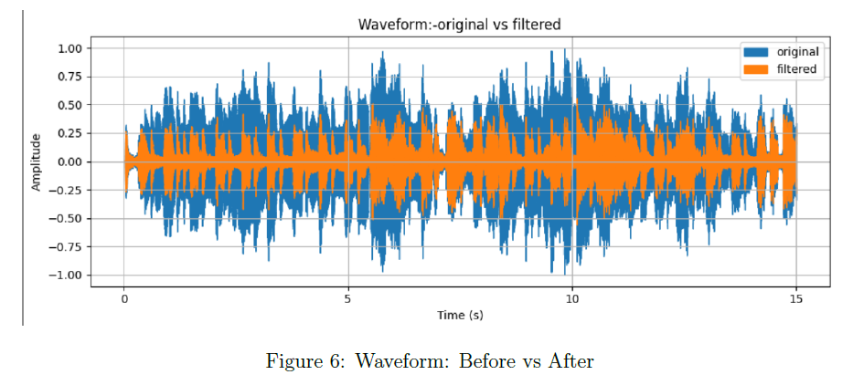
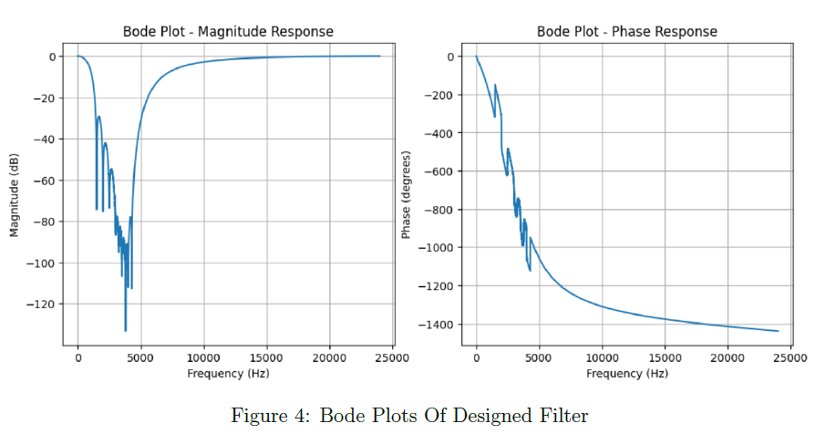

> **Note to Reviewers:** If you followed the link on my resume expecting to view the **[Frequency De-mixer : Unwanted Solo Removal]** repository, please click here: **[https://github.com/samayrajm57-hash/Frequency-Demixer-Audio-DSP]**

# Frequency De-mixer: Audio Solo Removal 🎵🔇

A digital signal processing (DSP) pipeline built in Python to isolate and remove an unwanted piccolo solo component from an audio track[cite: 4]. 

By utilizing frequency domain analysis and custom filter design, this project effectively suppresses targeted high-frequency interference to restore the original harmony of the song[cite: 4].

### Objective
To identify unwanted dominant frequencies using Fourier Transforms and Spectrograms, and design precise second-order IIR notch filters to eliminate acoustic interference without distorting the underlying musical structure[cite: 4].

---

## Methodology & DSP Pipeline

1. **Audio Normalization:** The input audio is decoded at its native sampling rate (48,000 Hz) to avoid resampling artifacts and normalized within the range `[-1, 1]` to prevent distortion[cite: 4].
2. **Frequency Domain Analysis:** 
    * Fast Fourier Transform (FFT) and Power Spectral Density (PSD) plots are utilized to locate dominant frequency peaks[cite: 4].
    * Spectrograms provide a time-frequency view, identifying the unwanted piccolo tones as persistent horizontal lines between 1000–5500 Hz[cite: 4].
3. **IIR Notch Filter Design:** Second-order IIR notch filters are designed and applied sequentially using `filtfilt` to ensure zero-phase distortion[cite: 4]. 
4. **Amplification & Restoration:** The cleaned signal is amplified with a constant gain factor and clipped to prevent overflow during playback[cite: 4].

---

## Results & Validation

*(Note: Add your output images to the `outputs/` folder for these links to work)*

### Filter Effectiveness (Pre vs. Post-Processing)
* **Power Spectral Density (PSD):** A deep suppression of energy is observed in the 1–6 kHz range, confirming the targeted removal of the instrumental interference[cite: 4].
* **Waveform Analysis:** The filtered signal exhibits a significant reduction in sharp transients and high-frequency oscillations while fully preserving the amplitude envelope of the original track[cite: 4].

| Spectrogram Analysis | PSD Comparison | Bode Plot Validation |
| :---: | :---: | :---: |
|  |  |  |

---

## Tech Stack
* **Python 3**
* **Librosa & Soundfile:** Audio decoding, manipulation, and playback[cite: 4].
* **SciPy (`scipy.signal`):** IIR notch filter design (`iirnotch`), zero-phase filtering (`filtfilt`), and PSD computation (`welch`)[cite: 4].
* **NumPy:** Matrix scaling and signal normalization[cite: 4].
* **Matplotlib:** Data visualization (Waveforms, Spectrograms, Bode Plots)[cite: 4].
